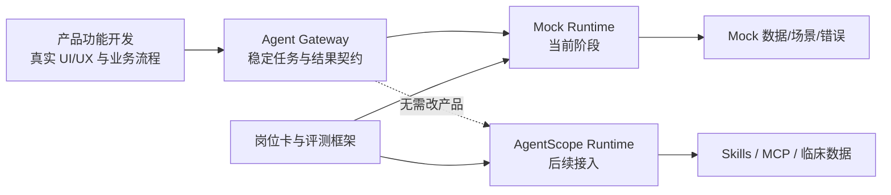
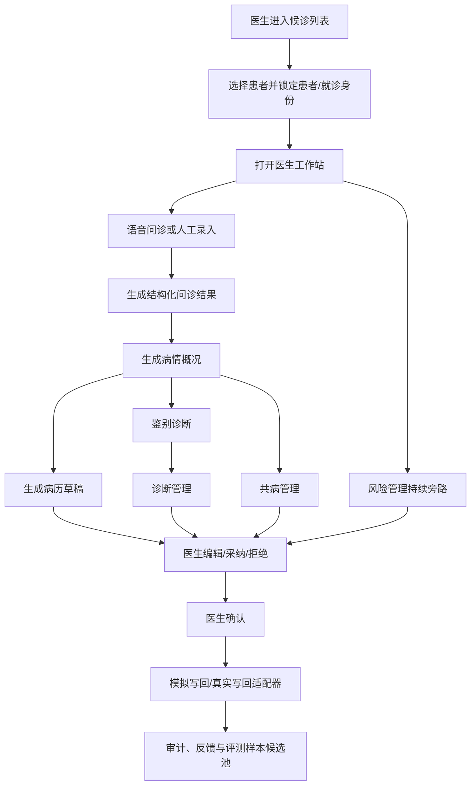

# Doctor Agent 一期研发总纲

版本：`v0.1-draft`
日期：2026-08-28
状态：前期准备稿，供产品、研发、Agent 集成、Agent 调优和临床共同确认

## 1. 当前已确认的研发策略

Doctor Agent 一期按三条工作线并行推进，但交付深度不同：

1. **产品功能开发条线**：以最快速度完成可运行的产品功能，包括用户流程、UI/UX、前后端状态、权限、审计和医生操作闭环。
2. **Agent 集成条线**：先完成接口契约、状态机、数据映射、卡片 View Model 和 Mock Agent Gateway；后续再替换为真实 AgentScope、Skills、MCP 和临床数据。
3. **Agent 岗位定义和调优条线**：先完成 6 个 Agent 的岗位卡、输入输出、上下文策略、评测数据格式、评分规则和 Mock 结果；真实 Prompt、模型、Worker、Skill 和评测调优逐步接入。

这意味着一期开发不是等待 Agent 完成后再做产品，而是先让产品在稳定契约上运行：

## 2. 一期产品口径

### 2.1 七个用户功能

1. 语音问诊
2. 病情概况
3. 病历生成
4. 鉴别诊断
5. 诊断管理
6. 风险管理
7. 共病管理

### 2.2 六个智能体岗位

| 智能体岗位 | 对应产品功能 |
| --- | --- |
| 语音问诊智能体 | 语音问诊 |
| 病情概况智能体 | 病情概况 |
| 病历生成智能体 | 病历生成 |
| 诊断智能体 | 鉴别诊断、诊断管理 |
| 风险管理智能体 | 风险管理 |
| 共病管理智能体 | 共病管理 |

产品功能不与智能体数量强行一一对应。用户看到的是临床任务，底层 Agent 是可治理的岗位。

### 2.3 首期专科与评测范围

- 内科首包：建议先落在内分泌代谢门诊，以 2 型糖尿病复诊和并发症筛查为首批场景。
- 骨科首包：建议普通骨科门诊，以颈肩腰腿痛、膝骨关节炎及红旗筛查为首批场景。
- 妇科首包：建议普通妇科，以异常子宫出血、HPV/TCT 异常随访为首批场景。

三科均进入 Mock 场景和离线评测准备；真实影子运行优先选数据、专家与接口准备度最高的两个专科。

## 3. 产品真实、能力 Mock 的边界

### 3.1 产品功能开发条线必须做成真实能力

- 登录、医生身份和角色权限。
- 候诊列表、患者切换和患者/就诊上下文固定展示。
- 七个功能入口、统一任务状态和操作回执。
- 病历编辑、诊断维护、风险确认、卡片采纳/拒绝/编辑/反馈。
- 前端状态持久化、调用日志、医生操作日志和错误处理。
- Mock API 也必须走真实网络请求与正式 Schema，不允许组件内部写死结果。
- 所有写回动作先进入“模拟写回”或隔离测试环境，未经确认不得触达正式病历或医嘱。

### 3.2 Agent 集成条线当前先做 Mock

- `task_request_v1`、`task_event_v1`、`semantic_result_v1`、`card_view_model_v1`、`audit_event_v1`。
- Mock Agent Gateway、任务队列、SSE/轮询状态、超时、失败、澄清和降级。
- AgentScope Adapter 接口占位。
- Skills、MCP、临床数据连接器的注册表与虚拟响应。
- 三专科 Mock 患者、正常/缺失/冲突/高风险等场景。

### 3.3 Agent 岗位定义和调优条线当前先做 Mock

- 六张岗位卡与版本号。
- 每个 Agent 的调用条件、最小输入、结构化输出和禁止行为。
- 上下文五层结构与 Mock Context Bundle。
- 评测数据集格式、评分器接口、错误分类和门禁报告样例。
- 每个功能至少准备成功、缺数据、数据冲突、高风险和执行失败五类结果。

## 4. 三条线的接口关系

| 交付对象 | 提供方 | 接收方 | 当前阶段的完成标志 |
| --- | --- | --- | --- |
| 用户场景与验收标准 | 产品功能开发条线 | 集成线、岗位与调优线 | 每个功能有入口、动作、状态、失败路径和验收用例 |
| 任务与结果契约 | Agent 集成条线 | 产品线、岗位与调优线 | Mock 与未来 AgentScope 使用同一 Schema |
| 卡片交互与展现 | Agent 集成条线 | 产品功能开发条线 | 每类结果有 View Model、动作、风险样式和审计事件 |
| Agent 岗位卡 | 岗位定义和调优条线 | Agent 集成条线 | 调用条件、上下文、输出、红线和指标可版本化 |
| 评测集与门禁 | 岗位定义和调优条线 | 三条线 | Mock 阶段可跑格式与流程，真实阶段替换金标准数据 |

## 5. 一期完整业务链路

## 6. 文档体系

| 文档 | 用途 |
| --- | --- |
| [`product/01-产品功能详细规格.md`](product/01-产品功能详细规格.md) | 七个产品功能、流程、状态、权限和验收标准 |
| [`product/02-UIUX详细规格与页面Mockup.md`](product/02-UIUX详细规格与页面Mockup.md) | 基于 V4.3 Demo 的页面、布局、组件和交互规范 |
| [`agent-integration/01-Agent集成与Mockup详细规格.md`](agent-integration/01-Agent集成与Mockup详细规格.md) | Agent Gateway、AgentScope Adapter、Schema、卡片和 Mock 运行时 |
| [`agent-roles-and-evaluation/01-Agent岗位与调优Mockup详细规格.md`](agent-roles-and-evaluation/01-Agent岗位与调优Mockup详细规格.md) | 六个岗位、上下文、评测集、指标和 Mock 输出策略 |
| [`implementation/01-快速开发准备与迭代计划.md`](implementation/01-快速开发准备与迭代计划.md) | 代码准备、纵向薄切、优先级、依赖和 Definition of Done |

## 7. 当前明确不做

- 自动处方、自动医嘱或未经医生确认的正式写回。
- 患者端直接诊断。
- 覆盖全部科室、全部病种的万能助手。
- 影像、病理或检验报告的自主签发。
- 由多个 Agent 自主协商并直接给产品返回不可解释结论。
- 在产品组件中直接耦合某个模型、Prompt 或 AgentScope 内部字段。

## 8. 待讨论与待确认

### 待讨论

- Worker 的运行时定义、数量和编排方式。
- 哪些能力属于稳定 Agent 岗位，哪些应实现为 Skill。
- 是否需要 Sub-agent、适用场景和最大层级。
- AgentScope 与 Nacos 的具体部署、路由、配置和观测方式。

### 待确认

- 三条线及临床安全治理的正式负责人。
- 产品前后端技术栈与现有 HIS 的嵌入方式。
- 三专科临床负责人、首批病种和两个影子运行专科。
- HIS/EMR/LIS/RIS/PACS 数据字段、权限、脱敏和审计要求。
- 真实写回边界以及签字责任人。

## 9. 本轮前期准备的完成定义

- Word 方案和 HTML Demo 已归档在 Doctor Agent 项目中。
- 产品、UI/UX、Agent 集成 Mock、Agent 调优 Mock 和快速开发计划均有独立 Markdown。
- 七个功能都有页面入口、任务状态、操作动作和验收标准。
- Mock 结果与未来真实 Agent 使用同一契约。
- 未决内容明确标记“待讨论”或“待确认”，不被误当作已决策方案。

