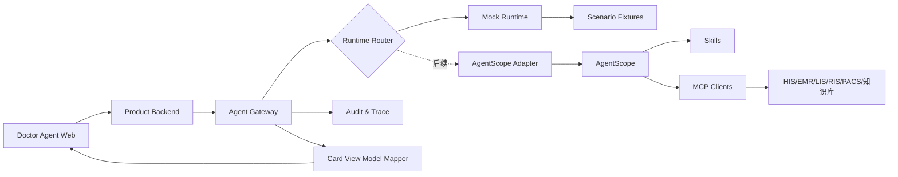

# Agent 集成与 Mockup 详细规格

Agent 配置后台、Haiku 模型 Profile、数据接口、版本发布、评测门禁和运行审计的完整规格见 [`02-Agent配置与运行控制台需求规格.md`](02-Agent配置与运行控制台需求规格.md)。本文件继续作为医生工作站与 Runtime/AgentScope 之间的任务、事件和结果契约。

版本：`v0.1-draft`
主责：Agent 集成条线
当前策略：先实现正式契约和 Mock Runtime，后续通过 Adapter 接入 AgentScope。

## 1. 集成层职责

Agent 集成层位于产品功能和 AgentScope 之间，负责三段完整链路：

1. **调用阶段**：确认用户、患者、就诊、任务类型、触发条件、权限和上下文版本。
2. **智能体执行阶段**：选择 Agent，准备上下文，控制 Skills/MCP、超时、重试、并发、降级和追踪。
3. **结果返回阶段**：校验语义结果，转换为卡片 View Model，承载医生交互、写回和审计。

卡片、产品交互和最终展现形式属于本条线；产品条线提供工作台容器和设计系统。

## 2. Mock-first 架构



关键原则：

- 产品只调用 Agent Gateway，不识别 Mock 或 AgentScope 内部实现。
- Mock 与真实运行时返回同一 `semantic_result_v1`。
- 真实 AgentScope 未就绪时，前端、状态机、卡片和医生反馈仍能完整开发和测试。
- 运行时通过环境配置或项目级 Feature Flag 切换，不在前端切换。

## 3. 七功能到六 Agent 的路由

| `task_type` | Agent 岗位 | 结果类型 |
| --- | --- | --- |
| `voice_interview` | `voice_interview_agent` | `interview_note` / `clarification_request` |
| `condition_summary` | `condition_summary_agent` | `condition_summary` |
| `record_generation` | `record_generation_agent` | `record_draft` |
| `differential_diagnosis` | `diagnosis_agent` | `diagnosis_candidates` |
| `diagnosis_management` | `diagnosis_agent` | `diagnosis_management` |
| `risk_management` | `risk_management_agent` | `risk_alert` |
| `comorbidity_management` | `comorbidity_agent` | `comorbidity_plan` |

## 4. API 草案

### 4.1 创建任务

`POST /api/v1/agent-tasks`

请求：`task_request_v1`。
响应：`202 Accepted`，返回 `task_id`、当前状态和事件订阅地址。

### 4.2 查询任务

`GET /api/v1/agent-tasks/{task_id}`

返回当前状态、进度摘要、最新语义结果和可用动作。

### 4.3 订阅任务事件

`GET /api/v1/agent-tasks/{task_id}/events`

一期建议使用 SSE；如医院网关不支持，再降级为短轮询。事件不得暴露模型内部思维链，只提供业务状态。

### 4.4 取消任务

`POST /api/v1/agent-tasks/{task_id}/cancel`

幂等。已完成任务返回当前终态，不伪造已取消。

### 4.5 提交澄清答案

`POST /api/v1/agent-tasks/{task_id}/clarifications`

只允许回答当前版本的待澄清项；过期问题返回版本冲突。

### 4.6 医生处理结果

`POST /api/v1/agent-tasks/{task_id}/actions`

动作包括：`accept`、`partial_accept`、`edit`、`reject`、`report_error`、`retry`。

### 4.7 写回

`POST /api/v1/write-back-requests`

Mock 阶段只调用 `MockWriteBackAdapter`。真实适配器启用前，响应必须明确 `mode=mock`。

## 5. task_request_v1

```json
{
  "schema_version": "task_request_v1",
  "request_id": "req_01J...",
  "idempotency_key": "enc_001:condition_summary:context_v12",
  "task_type": "condition_summary",
  "runtime_mode": "mock",
  "actor": {
    "user_id": "doctor_001",
    "role": "outpatient_doctor",
    "organization_id": "pkuih",
    "department_id": "endocrinology"
  },
  "subject": {
    "patient_id": "mock_patient_001",
    "encounter_id": "mock_encounter_001"
  },
  "trigger": {
    "source": "user_action",
    "event": "refresh_summary",
    "occurred_at": "2026-08-28T13:00:00+08:00"
  },
  "context_ref": {
    "context_version": "context_v12",
    "data_cutoff_at": "2026-08-28T12:58:00+08:00"
  },
  "expected_result_type": "condition_summary",
  "locale": "zh-CN",
  "trace_id": "trace_01J..."
}
```

### 5.1 必填校验

- 用户、组织、科室。
- 患者与就诊 ID。
- 任务类型和预期结果类型。
- 上下文版本和数据截至时间。
- 幂等键和追踪 ID。

任一患者身份字段缺失，任务不得进入运行时。

## 6. task_event_v1

```json
{
  "schema_version": "task_event_v1",
  "task_id": "task_01J...",
  "sequence": 3,
  "status": "preparing",
  "code": "CONTEXT_LOADING",
  "message": "正在读取本次就诊、历史病历和最新检验结果",
  "occurred_at": "2026-08-28T13:00:02+08:00",
  "trace_id": "trace_01J..."
}
```

允许的业务事件：

- `TASK_ACCEPTED`
- `CONTEXT_LOADING`
- `CONTEXT_READY`
- `AGENT_RUNNING`
- `CLARIFICATION_REQUIRED`
- `RESULT_READY`
- `TASK_CANCELLED`
- `TASK_FAILED`
- `TASK_DEGRADED`

## 7. semantic_result_v1

```json
{
  "schema_version": "semantic_result_v1",
  "task_id": "task_01J...",
  "task_type": "condition_summary",
  "result_type": "condition_summary",
  "status": "ready",
  "subject": {
    "patient_id": "mock_patient_001",
    "encounter_id": "mock_encounter_001"
  },
  "generated_at": "2026-08-28T13:00:05+08:00",
  "data_cutoff_at": "2026-08-28T12:58:00+08:00",
  "runtime": {
    "mode": "mock",
    "agent_id": "condition_summary_agent",
    "agent_version": "mock-0.1.0"
  },
  "content": {},
  "evidence_refs": [],
  "missing_data": [],
  "conflicts": [],
  "safety": {
    "severity": "info",
    "requires_acknowledgement": false,
    "blocking": false
  },
  "uncertainties": [],
  "allowed_actions": ["accept", "partial_accept", "edit", "reject", "retry"],
  "trace_id": "trace_01J..."
}
```

### 7.1 结果类型最小内容

| `result_type` | `content` 最小字段 |
| --- | --- |
| `interview_note` | `transcript_segments`、`clinical_entities`、`structured_history` |
| `condition_summary` | `summary`、`problems`、`timeline_changes` |
| `record_draft` | `sections`、`validation`、`source_map` |
| `diagnosis_candidates` | `candidates`、`next_steps` |
| `diagnosis_management` | `primary`、`secondary`、`to_rule_out`、`changes` |
| `risk_alert` | `alerts`、`highest_severity` |
| `comorbidity_plan` | `conditions`、`care_gaps`、`actions` |
| `clarification_request` | `questions`、`blocking_fields`、`reason` |
| `failed` | `error_code`、`safe_message`、`retryable`、`fallback` |

## 8. card_view_model_v1

语义结果先由集成层转换为卡片 View Model，前端不自行解释医学字段。

```json
{
  "schema_version": "card_view_model_v1",
  "card_id": "card_task_01J_summary",
  "task_id": "task_01J...",
  "component": "condition_summary_card",
  "title": "AI 病情概况",
  "status": "ready",
  "badges": [
    {"type": "runtime", "label": "Mock 结果"},
    {"type": "risk", "label": "高风险", "level": "red"}
  ],
  "meta": {
    "generated_at": "2026-08-28T13:00:05+08:00",
    "data_cutoff_at": "2026-08-28T12:58:00+08:00",
    "version_label": "condition_summary_agent mock-0.1.0"
  },
  "sections": [],
  "evidence_actions": [],
  "primary_actions": ["accept", "edit"],
  "secondary_actions": ["partial_accept", "reject", "retry", "view_trace"]
}
```

### 8.1 组件注册表

| 结果类型 | 产品组件 |
| --- | --- |
| `interview_note` | 实时转写抽屉 + 结构化病史面板 |
| `condition_summary` | 置顶病情概况卡 |
| `record_draft` | 病历编辑器草稿层 |
| `diagnosis_candidates` | 鉴别诊断候选卡组 |
| `diagnosis_management` | 诊断列表草稿与变更记录 |
| `risk_alert` | 顶部风险条 + 风险详情卡 |
| `comorbidity_plan` | 共病问题清单卡 |
| `clarification_request` | 澄清问题卡/抽屉 |
| `failed` | 失败与降级卡 |

## 9. 医生动作契约

```json
{
  "schema_version": "agent_result_action_v1",
  "task_id": "task_01J...",
  "result_version": 1,
  "action": "partial_accept",
  "selected_paths": ["content.problems[0]", "content.summary"],
  "edited_content": null,
  "reason_code": null,
  "actor_user_id": "doctor_001",
  "occurred_at": "2026-08-28T13:02:00+08:00"
}
```

规则：

- 所有动作必须携带结果版本，避免医生处理过期结果。
- `edit` 保存 AI 原文与医生修订后的差异。
- `reject` 和 `report_error` 必须有原因码，可附加简短说明。
- `accept` 只代表加入产品草稿，不自动代表正式写回。

## 10. Mock Runtime

### 10.1 目标

- 支撑七个产品功能的完整开发。
- 可重复制造正常、澄清、失败、降级和风险状态。
- 让 UI 测试、契约测试和 UAT 不依赖模型稳定性。

### 10.2 场景选择

Mock Runtime 根据以下字段选择 Fixture：

- `patient_id` / `encounter_id`
- `task_type`
- `context_version`
- 可选测试 Header：`X-Mock-Scenario`

测试 Header 仅在非生产环境有效，生产必须拒绝。

### 10.3 标准场景

每个任务类型至少实现：

- `success`
- `missing_optional_data`
- `clarification_required`
- `data_conflict`
- `high_risk`
- `timeout`
- `invalid_schema`
- `runtime_failure`
- `degraded_result`

### 10.4 延迟模拟

- `preparing`：300–800 ms。
- `running`：800–2500 ms。
- 超时场景：超过产品配置的任务超时阈值。

延迟配置应可测试覆盖，不把固定等待写入前端。

## 11. AgentScope Adapter 占位接口

```ts
interface AgentRuntimeAdapter {
  submit(request: TaskRequestV1, context: ContextBundleV1): Promise<RuntimeTaskRef>;
  subscribe(runtimeTaskId: string): AsyncIterable<TaskEventV1>;
  getResult(runtimeTaskId: string): Promise<SemanticResultV1>;
  cancel(runtimeTaskId: string): Promise<void>;
}
```

一期实现：

- `MockRuntimeAdapter`

后续实现：

- `AgentScopeRuntimeAdapter`

AgentScope 的 SDK、HTTP 协议、鉴权、Nacos 服务发现和部署方式均为待确认，不提前绑定到产品接口。

## 12. Skills、MCP 与数据注册表

### 12.1 Skill 注册字段

- `skill_id`
- `version`
- `description`
- `allowed_agents`
- `input_schema`
- `output_schema`
- `timeout_ms`
- `deterministic`
- `clinical_risk_level`
- `owner`

### 12.2 MCP 注册字段

- `mcp_server_id`
- `capability`
- `data_domain`
- `read_or_write`
- `required_permission`
- `patient_scope_required`
- `timeout_ms`
- `retry_policy`
- `audit_policy`
- `owner`

### 12.3 首批数据域

| 数据域 | Mock | 真实接入状态 |
| --- | --- | --- |
| 患者与就诊身份 | 必须 | 待确认 |
| 当前门诊病历 | 必须 | 待确认 |
| 历史病历 | 必须 | 待确认 |
| 诊断 | 必须 | 待确认 |
| 用药与过敏 | 必须 | 待确认 |
| 生命体征 | 必须 | 待确认 |
| LIS 检验 | 必须 | 待确认 |
| RIS/PACS 检查摘要 | 必须 | 待确认 |
| 专科规则、模板和术语 | 必须 | 待确认 |

## 13. 错误与降级

| 错误码 | 产品含义 | 建议处理 |
| --- | --- | --- |
| `IDENTITY_MISMATCH` | 患者/就诊身份不一致 | 阻断，重新加载患者 |
| `PERMISSION_DENIED` | 无权限读取或调用 | 阻断，联系管理员 |
| `CONTEXT_INCOMPLETE` | 缺少关键数据 | 进入澄清或人工完成 |
| `CONTEXT_CONFLICT` | 数据来源冲突 | 展示冲突，不自动合并 |
| `RUNTIME_TIMEOUT` | Agent 超时 | 可重试或降级 |
| `TOOL_UNAVAILABLE` | Skill/MCP 不可用 | 跳过非关键工具或失败 |
| `INVALID_RESULT_SCHEMA` | 结果不符合契约 | 不展示临床内容，记录技术错误 |
| `SAFETY_GATE_FAILED` | 安全门禁未通过 | 阻断结果进入产品 |
| `WRITE_BACK_FAILED` | 写回失败 | 保留草稿，允许幂等重试 |

## 14. SLO 建议稿

| 指标 | Mock 阶段 | 真实阶段建议 |
| --- | --- | --- |
| 创建任务 API | P95 < 300 ms | P95 < 500 ms |
| 首个状态事件 | P95 < 500 ms | P95 < 1 s |
| 病情概况结果 | 可配置 1–3 s | 目标待实测确认 |
| 取消任务确认 | P95 < 1 s | P95 < 2 s |
| 结果 Schema 合法率 | 100%（非法场景除外） | 100% 才进入产品 |
| 患者身份错配 | 0 | 0 |
| 未确认写回 | 0 | 0 |

## 15. 集成线 Definition of Done

- 产品所有 Agent 调用均通过 Gateway。
- Mock 与 AgentScope Adapter 共用接口。
- 任务请求、事件、语义结果、卡片和审计 Schema 有版本。
- 卡片交互和产品动作由集成线提供稳定契约。
- 超时、取消、澄清、失败、降级和重试可演示、可测试。
- 患者/就诊/权限校验在运行前和结果返回时各执行一次。
- 非法结果不能进入 UI 或写回。
- 每次调用可按 `trace_id` 追踪。
- Worker、岗位与 Sub-agent 的具体实现仍标记为“待讨论”，不影响当前契约。
