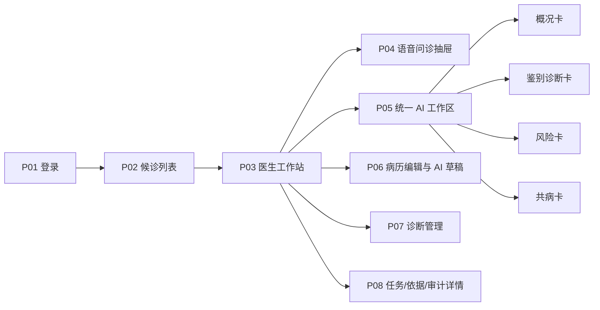

# Doctor Agent 一期 UI/UX 详细规格与页面 Mockup

版本：`v0.1-draft`
参考：`references/ui-demo/AI-HIS门诊模块V4.3.html`
说明：继承 Demo 的信息架构与交互语言，不继承单文件 Mock 技术实现。

## 1. 设计目标

- 医生不离开门诊工作流即可使用 AI。
- 患者身份、风险和数据时间始终清晰。
- AI 结果是可操作的临床对象，不是长篇聊天文本。
- 高频操作一步可达，复杂依据按需展开。
- 医生已有输入永不因刷新、失败或重新生成而丢失。
- Mock 与真实 Agent 切换时，页面结构和交互保持不变。

## 2. 页面地图



## 3. P01 登录页

### 3.1 保留的 Demo 特征

- 居中登录卡。
- 医院与系统名称清晰。
- 简洁用户名、密码和进入按钮。

### 3.2 生产规格

- 显示医院、环境标记、产品版本和隐私提示。
- 生产环境不得出现“任意密码”“纯前端演示”等文案。
- 登录失败不暴露账户是否存在。
- 支持院内统一身份或 HIS 单点登录，具体方案待确认。

## 4. P02 候诊列表

### 4.1 页面布局

```text
┌──────────────────────────────────────────────────────────────────────────┐
│ 医院 / Doctor Agent                    AI 服务状态     医生 / 日期 / 退出 │
├──────────────────────────────────────────────────────────────────────────┤
│ 搜索患者   科室筛选   风险筛选   接诊状态   今日候诊数量          刷新 │
├──────────────────────────────────────────────────────────────────────────┤
│ [患者卡] [患者卡] [患者卡]                                                │
│ [患者卡] [患者卡] [患者卡]                                                │
│ 每卡：姓名、性别、年龄、科室、主诉、既往诊断、风险、候诊状态、数据时间   │
└──────────────────────────────────────────────────────────────────────────┘
```

### 4.2 患者卡

| 区域 | 内容 | 规则 |
| --- | --- | --- |
| 头部 | 姓名、性别、年龄、科室 | 测试数据用明显“Mock”标记 |
| 标签 | 门诊状态、风险级别、特殊状态 | 红色风险优先显示 |
| 主体 | 主诉、已有诊断 | 最多两行，支持悬浮查看完整内容 |
| 底部 | 日期、主治医生、进入工作站 | 身份不完整时按钮禁用并说明原因 |

### 4.3 筛选与排序

- 搜索：姓名、门诊号、患者 ID、主诉、诊断。
- 筛选：科室、风险、候诊/接诊/完成状态、Mock/真实患者。
- 默认排序：需立即处理的红色风险 → 候诊顺序 → 预约时间。

## 5. P03 医生工作站

### 5.1 推荐桌面布局

```text
┌────────────────────────────────────────────────────────────────────────────────────┐
│ 返回候诊 | 患者姓名 性别 年龄 科室 就诊号 | 过敏/特殊状态 | 风险 | 数据截至时间    │
├──────┬──────────────────────────────────────────┬──────────────────────────────────┤
│患者  │ 主临床区                                 │ 统一 AI 工作区                   │
│队列  │ ┌──────────────────────────────────────┐ │ ┌──────────────────────────────┐ │
│      │ │ 病历 / 诊断 / 医嘱 / 检验检查       │ │ │ 7 个产品功能入口             │ │
│      │ │                                      │ │ ├──────────────────────────────┤ │
│      │ │ 病历编辑器与 AI 草稿逐段对照         │ │ │ 结果卡 / 澄清 / 失败 / 依据  │ │
│      │ │                                      │ │ │                              │ │
│      │ └──────────────────────────────────────┘ │ │                              │ │
│      │ ┌──────────────────────────────────────┐ │ │                              │ │
│      │ │ 阳性结果 / 时间线 / 诊断列表         │ │ └──────────────────────────────┘ │
│      │ └──────────────────────────────────────┘ │ [语音问诊] [补充消息] [快捷动作] │
├──────┴──────────────────────────────────────────┴──────────────────────────────────┤
│ 暂存 | 保存诊断 | 提交病历 | 待处理风险 n | 待写回内容 n | 任务与审计              │
└────────────────────────────────────────────────────────────────────────────────────┘
```

### 5.2 尺寸建议

- 一期以院内桌面端为主，设计基准宽度 `1440px`，最低支持 `1280px`。
- 顶部患者安全条固定高度约 `40–48px`。
- 左侧患者队列展开 `200–220px`，收起 `44–48px`。
- 主临床区约占剩余空间的 `55–62%`。
- AI 工作区默认 `380–460px`，允许拖拽调整和收起。
- 宽度不足时优先收起患者队列，再将 AI 工作区变为抽屉；不得压缩关键病历字段到不可读。

### 5.3 顶部患者安全条

必须持续显示：

- 患者姓名、性别、年龄。
- 患者 ID/门诊号与当前就诊 ID。
- 科室和主治医生。
- 过敏、妊娠等特殊状态。
- 当前最高风险等级。
- 数据截至时间。
- Mock/真实环境标记。

患者切换后，先清空旧患者 AI 结果，再加载新患者上下文。任何延迟返回的旧任务结果必须被拦截。

## 6. 统一 AI 工作区

### 6.1 功能导航

推荐使用七个明确入口，不沿用 Demo 中含义不一致的“智慧诊疗、预警评估、病历管理、医嘱管理”等宽泛分类：

1. 语音问诊
2. 病情概况
3. 病历生成
4. 鉴别诊断
5. 诊断管理
6. 风险管理
7. 共病管理

入口可使用图标与短标签；风险管理显示未处理数量，运行中的功能显示状态点。

### 6.2 功能入口状态

| 状态 | 视觉 | 交互 |
| --- | --- | --- |
| 可用 | 正常图标与文字 | 点击调用或进入结果 |
| 未满足条件 | 灰色并有锁/提示 | 悬浮显示缺少内容 |
| 运行中 | 进度点或轻量动画 | 点击查看进度，可取消 |
| 有新结果 | 蓝色提示点 | 点击进入最新结果 |
| 有高风险 | 红色数量徽标 | 优先跳转风险详情 |
| 失败 | 黄色/灰色错误标 | 点击查看失败和重试 |

## 7. 统一结果卡规范

```text
┌──────────────────────────────────────────────┐
│ [结果类型] 标题                 状态 / 风险级别│
│ 生成时间 · 数据截至时间 · Agent/Mock 版本     │
├──────────────────────────────────────────────┤
│ 核心结论                                     │
│                                              │
│ 关键证据 2 条 · 缺失信息 1 条 · 冲突 0 条     │
│ [展开依据] [查看原始数据]                     │
├──────────────────────────────────────────────┤
│ [采纳] [部分采纳] [编辑] [拒绝] [重新生成]   │
└──────────────────────────────────────────────┘
```

### 7.1 卡片头部

- 结果类型和明确标题。
- `ready/edited/accepted/rejected` 等状态。
- 风险等级。
- 生成时间、数据截至时间和版本。
- “Mock 结果”必须有永久标记，不能只靠颜色区分。

### 7.2 卡片正文

- 先结论，后证据与说明。
- 医学长文本默认折叠，不超过 5–7 行。
- 缺失数据和冲突独立显示，不混入普通说明。
- 每条证据可跳转到病历、检验、检查或用药原始位置。

### 7.3 卡片底部

- 主动作最多两个，次要动作放入更多菜单。
- 采纳动作必须区分“加入草稿”和“确认写回”。
- 拒绝默认要求选择原因：不准确、无关、过时、缺数据、重复、其他。

## 8. P04 语音问诊抽屉

```text
┌──────────────────────────────────────────────┐
│ 语音问诊                   录音中 00:03:28   │
├──────────────────────────────────────────────┤
│ 逐句转写                                     │
│ 10:21:03 患者：最近两周总觉得口渴…… [纠错]  │
│ 10:21:10 医生：夜间排尿次数呢？       [纠错]  │
├──────────────────────────────────────────────┤
│ 已提取：口渴、多饮、2周                       │
│ 待确认：夜尿次数                              │
│ 必须澄清：无                                  │
├──────────────────────────────────────────────┤
│ [暂停] [结束] [生成结构化记录]                │
└──────────────────────────────────────────────┘
```

- 低置信内容使用下划线或图标标记，不使用红色风险色。
- 支持定位音频时间，不自动播放。
- 医生关闭抽屉后录音状态必须清晰，避免误录。

## 9. P06 病历编辑与 AI 草稿

保留原 Demo “门诊病历 + 智能笔记”的并行思路，但使用段落级差异与采纳动作：

| 区域 | 内容 |
| --- | --- |
| 左侧/主体 | 医生正式草稿，始终可编辑 |
| 右侧/浮层 | AI 生成段落、来源和不确定性 |
| 段落动作 | 采纳、合并、拒绝、恢复、查看来源 |
| 差异模式 | AI 原文、医生当前文本和差异高亮 |

规则：

- AI 刷新只更新 AI 草稿，不直接覆盖医生文本。
- “全部采纳”仅作用于未编辑字段；已编辑字段必须二次确认。
- 必填字段、风险冲突和未处理澄清在提交前统一检查。

## 10. P07 诊断管理

### 10.1 三类诊断

- 主诊断：仅一个。
- 次诊断：多个，可排序。
- 待排诊断：与确诊视觉分开。

### 10.2 交互规则

- 从鉴别诊断卡拖入/加入诊断列表。
- 设置主诊断、排序、合并、删除和编辑编码。
- AI 建议使用虚线边框或“AI 建议”标签；医生确认后转为普通草稿样式。
- 概率或置信度不得作为确诊标识。

## 11. 风险视觉系统

| 语义 | 建议颜色 | 用途 |
| --- | --- | --- |
| 产品主色 | `#3B6EF5` | 选中、主按钮、可操作链接 |
| 深色导航 | `#1A2A4A` / `#1E3A5F` | 顶部导航，与原 Demo 一致 |
| 成功 | `#52C41A` | 已完成、已写回、服务正常 |
| 红色风险 | `#E6191A` | 阻断风险、严重过敏冲突 |
| 黄色风险 | `#D97706` / `#E67E22` | 警示、重要缺失、需确认 |
| 信息 | `#1677FF` | 一般提醒、来源信息 |
| 页面背景 | `#F0F2F5` | 工作站背景 |
| 分割线 | `#E8ECF2` | 区域和表格分隔 |

颜色不能作为唯一信息载体；同时使用文字、图标和级别名称。

## 12. 加载、空状态和失败状态

### 12.1 加载

- `preparing`：显示正在准备哪些数据，不显示虚假的百分比。
- `running`：显示任务类型和已用时间，可取消。
- 长任务允许医生继续编辑病历，结果就绪后非阻断提示。

### 12.2 空状态

- “没有结果”与“尚未调用”分开。
- 显示触发条件和所需数据。
- 空状态不占据大面积临床工作区。

### 12.3 失败

- 给医生可理解的信息，不展示堆栈或模型错误。
- 明确是否可重试、是否已降级、医生已输入内容是否保存。
- 非关键 Agent 失败不得阻塞病历人工完成。

## 13. 键盘与效率

- `Ctrl/Cmd + /`：展开或收起 AI 工作区。
- `Alt + 1…7`：切换七个功能，是否启用待确认。
- `Ctrl/Cmd + S`：暂存当前病历草稿。
- `Esc`：关闭当前非阻断抽屉或弹窗，不取消后台任务。
- 所有快捷键在页面帮助中可见，且不覆盖 HIS 既有快捷键。

## 14. 可用性与无障碍

- 关键文字正文不小于 `12px`，病历输入建议 `13–14px`。
- 点击目标至少 `32px`，高频主按钮建议 `36px` 以上。
- 键盘可到达所有主要操作。
- 表单错误与字段关联，不只显示顶部 Toast。
- 风险信息支持屏幕阅读器语义和焦点跳转。
- 不通过颜色、闪烁或动画单独传递临床风险。

## 15. UI Mock 数据要求

每个专科至少准备以下患者：

- 典型病例。
- 关键数据缺失病例。
- 历史与本次数据冲突病例。
- 红旗高风险病例。
- 多共病病例。
- Agent 超时/失败演示病例。

Mock 数据固定使用去标识化姓名和测试 ID，并在页面顶部显示“Mock 环境”。

## 16. UI/UX 验收清单

- 医生能在 30 秒内从候诊列表进入患者并找到七个功能。
- 当前患者、就诊、风险和数据时间在任何状态下都可见。
- AI 工作区收起后，红色风险仍可见。
- 卡片具备来源、状态、操作和版本。
- 病历生成不会覆盖医生未保存修改。
- 患者切换不会展示上一患者延迟返回的结果。
- 1280px 和 1440px 下无横向内容截断。
- 正常、空、澄清、失败、降级和权限不足状态均有设计。

