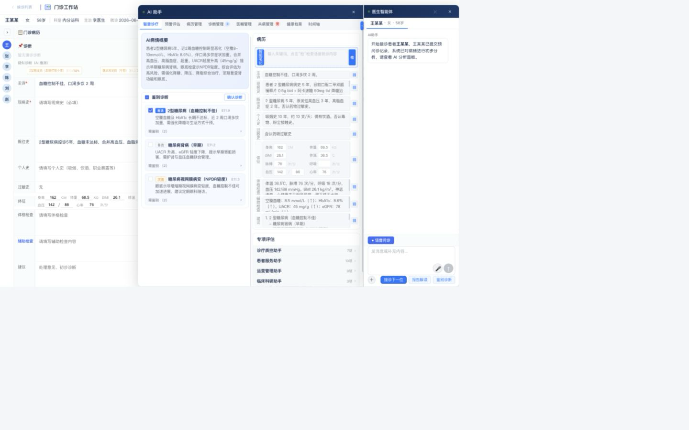
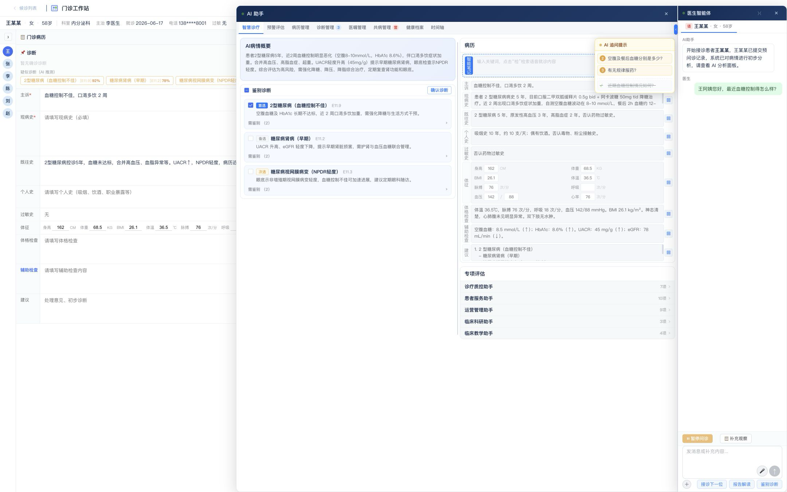
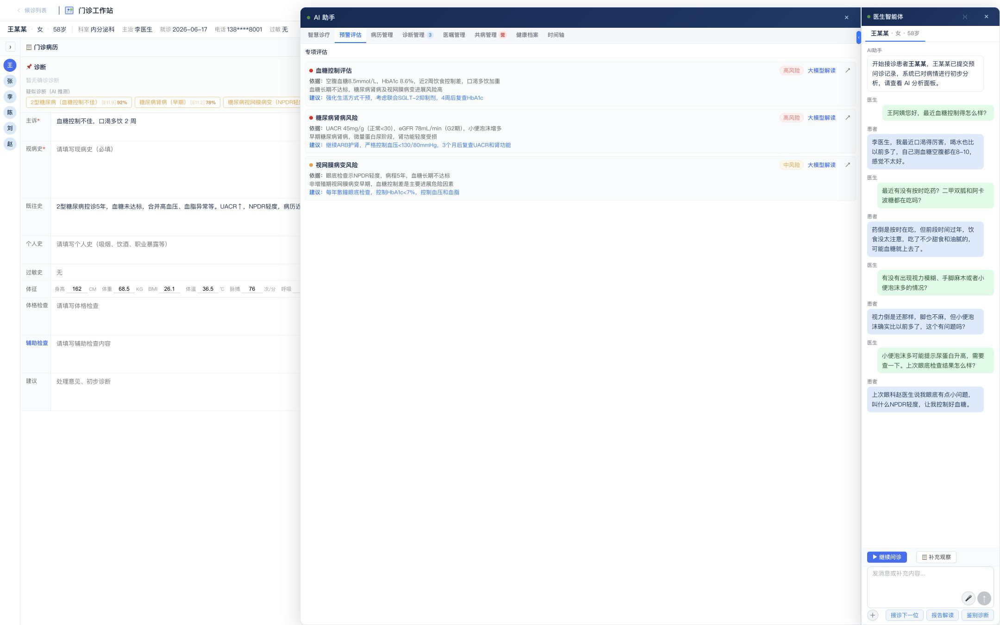
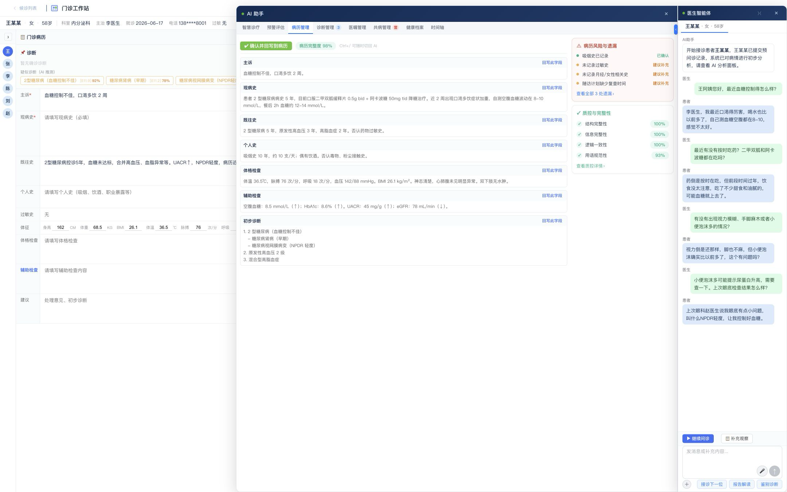
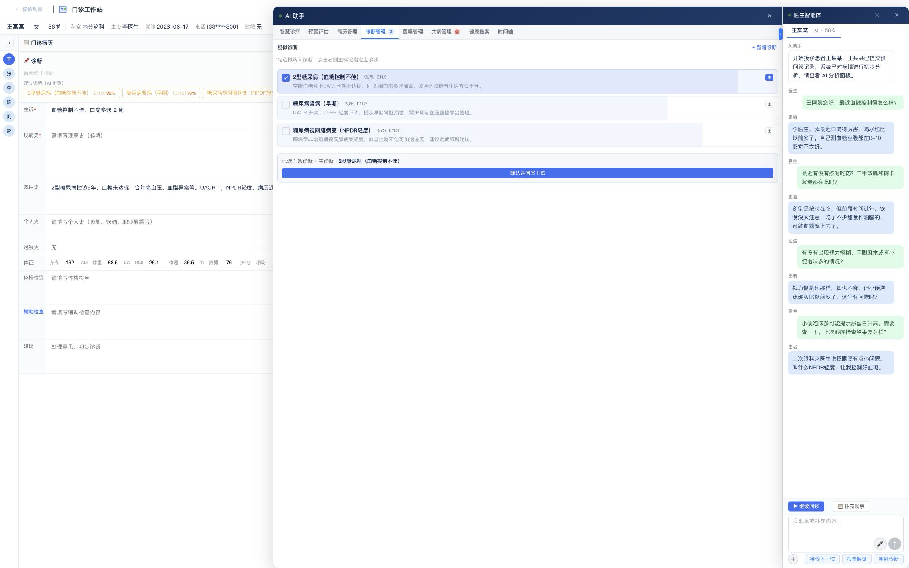
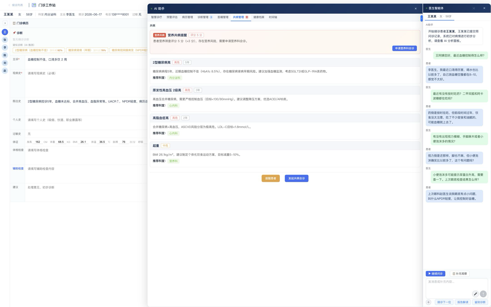
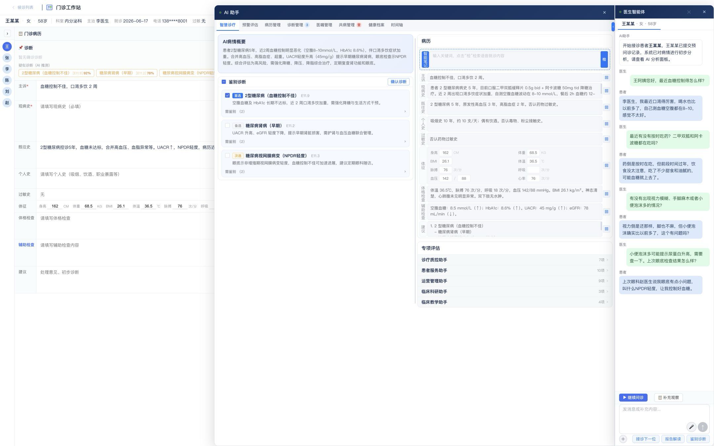

# Doctor Agent 一期 UI/UX 原型与需求追踪说明

版本：`v0.5-draft`  
日期：`2026-08-29`  
状态：UI/UX 基线已确认；功能内容与验收规则待最终评审

## 1. 文档目的

本文件把一期当前 HTML 的用户界面、7 个产品功能、6 个 Agent、交互状态和测试用例建立一一对应关系，作为前端实现、Agent 集成、测试和最终 PRD 的共同依据。

界面以 [`design/current/AI-HIS医生智能体一期.html`](../../design/current/AI-HIS医生智能体一期.html) 为直接实现基线。最早原件保存在 [`references/ui-demo/AI-HIS门诊模块V4.3.html`](../../references/ui-demo/AI-HIS门诊模块V4.3.html)。

F01/F03 的页面结构、状态机、八类字段、Agent 契约和验收细则见 [`06-F01-F03语音问诊与病历生成UI需求规格.md`](06-F01-F03语音问诊与病历生成UI需求规格.md)。

## 2. 已确认的 UI/UX 决策

1. 沿用最早 HTML 的布局、视觉风格、组件和主体交互，不进行整体改版。
2. 删除界面内所有“惠每”文字，不自动补入新的品牌前缀。
3. 本地演示不显示登录页，打开系统直接进入 `/outpatient/list` 候诊列表。
4. 点击患者卡或“进入医生智能体”后进入 `/outpatient`。
5. 进入工作站时患者与就诊上下文已经绑定，医生智能体自动展开并生成默认智慧诊疗结果。
6. 正式环境仍保留医院 SSO 接入边界，认证发生在候诊列表之前。
7. 7 个一期功能复用原 HTML 的智慧诊疗、风险预警、病历管理、诊断管理、共病管理、智能笔记和医生智能体区域。

## 3. 入口与患者绑定流程

| 顺序 | 用户/系统动作 | 产品状态 |
|---|---|---|
| 1 | 打开本地演示 | 直接显示候诊患者列表 |
| 2 | 点击患者卡或“进入医生智能体” | 绑定 patient_id 与 encounter_id，完成上下文校验 |
| 3 | 进入患者工作站 | 自动展开医生智能体并生成智慧诊疗结果 |
| 4 | 调用一期七项功能 | 显示准备、运行、澄清、成功或降级状态 |
| 5 | 医生确认/编辑/拒绝 | 仅对确认结果执行模拟写回并生成审计记录 |

患者未绑定时，只允许导航、查看帮助、查找/绑定患者和退出。依赖临床上下文的 Agent 不得被调用，也不能展示上一位患者结果。

## 4. 原型图总览

| 原型 ID | 原型图 | 页面/状态 | 对应功能 |
| --- | --- | --- | --- |
| P01 | 候诊列表（当前实现） | 系统默认首屏 | 全局入口与患者选择 |
| P02 | 患者工作站（当前实现） | 点击患者后自动展开医生智能体 | 全局入口与患者绑定 |
| P03 | [患者上下文已绑定](prototypes/P03-doctor-agent-patient-context.png) | 患者资料加载完成 | 全局、F02–F07 |
| P04 | [语音问诊](prototypes/P04-F01-voice-interview.png) | 问诊进行中 | F01 |
| P05 | [风险管理](prototypes/P05-F06-risk-management.png) | 高/中风险展示 | F06 |
| P06 | [病历生成](prototypes/P06-F03-record-generation.png) | 分字段草稿、遗漏与质控 | F03 |
| P07 | [诊断管理](prototypes/P07-F05-diagnosis-management.png) | 候选选择、主诊断和写回 | F05 |
| P08 | [共病管理](prototypes/P08-F07-comorbidity-management.png) | 共病、营养风险和会诊建议 | F07 |
| P09 | [病情概况与鉴别诊断](prototypes/P09-F02-F04-summary-differential.png) | 概况、候选诊断和智能笔记 | F02、F04 |
| P10 | 专项评估（Figma 高保真） | 五类助手、33 项专项能力和行内结果 | 场景化技能入口；复用 F02/F04/F06 等能力，不新增一期核心功能 |

### 4.1 当前 Figma 高保真验收状态

| 状态 ID | Figma | 页面状态 | 验收重点 |
| --- | --- | --- | --- |
| S01 | [F01 语音问诊进行中（节点 7:2）](https://www.figma.com/design/o9ZgZ6ujTK03MGOWQ2yQeC?node-id=7-2) | 右侧逐轮医患对话，左侧悬浮 AI 追问提示 | 对话位置、气泡角色、追问更新、病历等待态 |
| S01B | [F01 补充观察展开（节点 16:2）](https://www.figma.com/design/o9ZgZ6ujTK03MGOWQ2yQeC?node-id=16-2) | 问诊进行中显示补充观察按钮和专科动态候选浮层 | 独立来源、医生主动选择、去重、对话回显和证据引用 |
| S02 | [F01+F03 问诊完成及病历生成（节点 8:2）](https://www.figma.com/design/o9ZgZ6ujTK03MGOWQ2yQeC?node-id=8-2) | 完整对话保留，追问提示消失，中间生成八类病历字段 | 自动调用顺序、八字段、重新问诊、医生编辑保护 |
| S03 | [F06 风险提示 + 专项评估（节点 25:2）](https://www.figma.com/design/o9ZgZ6ujTK03MGOWQ2yQeC?node-id=25-2) | 左侧红色/黄色风险闭环，右侧五类助手与 33 项专项能力 | 红色必须处置并阻断；黄色处理或留痕；专项分组色不表示临床风险 |
| S04 | [专项评估默认折叠（节点 36:2）](https://www.figma.com/design/o9ZgZ6ujTK03MGOWQ2yQeC?node-id=36-2) | 五个助手只显示组名、数量和展开入口 | 首次进入、刷新和切换患者后默认全部折叠 |
| S05 | [智慧诊疗风险预警入口（节点 36:185）](https://www.figma.com/design/o9ZgZ6ujTK03MGOWQ2yQeC?node-id=36-185) | 不能漏诊候选左下方显示风险预警与查看详细 | 点击直达同患者/同就诊的 F06 权威风险状态 |
| S06 | [风险预警详细（节点 37:2）](https://www.figma.com/design/o9ZgZ6ujTK03MGOWQ2yQeC?node-id=37-2) | 专项评估、风险列表、单项详情、医生 Skills 与处置入口 | 默认折叠详情；完整显示证据、来源、阈值、不确定性和审计边界 |

Cover 页旧探索稿 `5:2` 已归档，不得作为一期验收基线。

## 5. 逐屏原型规格

### 5.1 P01 候诊列表入口

**目标**：本地演示打开即看到患者，减少演示前置步骤。

**主要元素**：患者筛选、候诊患者卡、科室、主诉、病例类型和“进入医生智能体”按钮。

**交互规则**：

- `UI-G-001` 打开本地演示后默认进入 `/outpatient/list`，不得出现登录选择。
- `UI-G-002` 点击患者卡或“进入医生智能体”后进入 `/outpatient`。
- `UI-G-003` 进入工作站前必须完成患者、就诊和医生上下文校验。
- `UI-G-004` 页面标题和正文不得出现“惠每”。

**对应测试**：`TC-UI-001`～`TC-UI-004`。

### 5.2 P02 患者工作站与医生智能体

**目标**：点击患者后直接进入该患者工作站，并立即看到医生智能体和默认智慧诊疗结果。

**可执行动作**：语音问诊、智慧诊疗、风险预警、病历管理、诊断管理、医嘱管理、共病管理、健康档案和时间轴。

**交互规则**：

- `UI-G-005` 工作站必须显示从候诊列表点击进入的患者身份，不得展示上一患者结果。
- `UI-G-006` 患者绑定后自动运行病情概况和鉴别诊断；病历草稿必须等待语音问诊完成后自动生成。
- `UI-G-007` 患者切换时立即清空上一患者结果，并重新建立上下文。
- `UI-G-008` 点击“候诊列表”返回首屏，不经过登录页。

**对应测试**：`TC-UI-005`～`TC-UI-009`、`TC-SAFE-001`。

### 5.3 P03 患者上下文已绑定

**目标**：在一个门诊工作站内完成患者识别、病历、AI 分析和医生智能体操作。

**必须可见**：姓名、性别、年龄、科室、主治医生、就诊日期、脱敏电话、过敏、门诊类型、最高风险、患者快捷切换、当前功能导航。

**交互规则**：

- `UI-G-009` 每次患者绑定或切换后重新校验 `patient_id`、`encounter_id` 和当前医生权限。
- `UI-G-010` 切换患者立即清空前一患者的 AI 可见结果；迟到结果只进入审计。
- `UI-G-011` 主病历区、AI 助手区和医生智能体区继续沿用原 HTML 布局。
- `UI-G-012` Agent 结果标识 Mock/真实运行模式、生成时间、数据截止时间和版本。

**对应测试**：`TC-UI-010`～`TC-UI-014`、`TC-SAFE-002`～`TC-SAFE-004`。

### 5.4 P04 F01 语音问诊

**目标**：通过医生明确开始的语音问诊获取可复核对话和结构化病史。

**界面内容**：医患对话、AI 追问提示、暂停/继续、补充观察按钮及动态观察浮层、消息输入、录音入口、当前患者。

**关键规则**：对应 `UX-F01-001`～`UX-F01-013`、`BR-F01-001`～`BR-F01-008`、`SAFE-F01-001`～`SAFE-F01-003`。医患对话位于最右侧医生智能体，“AI 追问提示”紧贴其左侧浮动；不得用中间区域另建语音问诊页。最后一轮对话完成前不得生成病历，完成后按“转写结构化 → 中间智能笔记病历草稿”顺序自动执行。

**当前高保真画面**：[Figma 节点 7:2](https://www.figma.com/design/o9ZgZ6ujTK03MGOWQ2yQeC?node-id=7-2)（AI 追问提示）和 [Figma 节点 16:2](https://www.figma.com/design/o9ZgZ6ujTK03MGOWQ2yQeC?node-id=16-2)（补充观察展开）。完整 UI 规则对应 `UI-VR-001`～`014`、`UI-VR-021`～`029`、`BR-VR-001`～`005`。

**补充观察规则**：问诊进行中或暂停时可打开；候选项随专科和患者问题动态变化；选中项以医生 `【补充观察】…` 回显，并以独立来源进入 F01/F03。对应 `UI-VR-021`～`029`。

**原型补齐要求**：生产实现必须在现有对话区域内增加时间戳、说话主体、低置信标记、纠错、录音时长、中断重连和结束确认；不得新建另一套问诊页面。

**对应测试**：`TC-F01-001`～`TC-F01-014`。

### 5.5 P05 F06 风险管理

**目标**：在原“预警评估”区域以统一医生入口“风险预警”展示风险等级、依据、影响和建议，并形成医生处置闭环。

**界面内容**：风险提示、红色·紧急、黄色·中度、关键依据、处理时限、闭环状态、建议和详情入口。专项评估位于独立区域，不作为患者风险列表的一部分。

**关键规则**：对应 `UX-F06-001`～`UX-F06-015`、`BR-F06-001`～`BR-F06-005`、`SAFE-F06-001`～`SAFE-F06-003`。红色表示比较紧张、必须立即处置并阻断关键提交；黄色表示相对中度、须处理或有因留痕。两级均须同时使用颜色、文字和图标表达。

**当前高保真画面**：[Figma 节点 37:2](https://www.figma.com/design/o9ZgZ6ujTK03MGOWQ2yQeC?node-id=37-2)。风险首层按未闭环红色、未闭环黄色、其余风险排序，提供“查看详细”；展开后显示影响/门禁、证据、来源/时间、阈值、不确定性、专项评估、Skills 和可达的处置动作。

**原型补齐要求**：增加已阅、处置中、已解决、误报、有因忽略状态；红色风险未闭环时阻断病历/诊断模拟写回，黄色风险在提交前必须已阅、处理或有因留痕。

**对应测试**：`TC-F06-001`～`TC-F06-019`、`TC-RN-N-*`、`TC-RN-B-*`、`TC-RN-E-*`、`TC-SAFE-010`～`TC-SAFE-015`。

### 5.6 P06 F03 病历生成

**目标**：按病历字段生成可编辑草稿，支持单字段回写、完整性检查和遗漏提示。

**界面内容**：智能笔记等待/生成/完成状态、主诉、现病史、既往史、个人史、过敏史、体格检查、辅助检查、初步诊断、单字段送回、风险与遗漏、质控评分。

**关键规则**：对应 `UX-F03-001`～`UX-F03-010`、F03 全部业务与安全规则。

**当前高保真画面**：[Figma 节点 8:2](https://www.figma.com/design/o9ZgZ6ujTK03MGOWQ2yQeC?node-id=8-2)。问诊结束前不生成完整病历；完成后追问提示消失、完整对话保留，并按固定结构自动生成八类字段。完整 UI 规则对应 `UI-VR-015`～`020`。

**原型补齐要求**：按钮在一期必须显示“模拟写回”语义；医生编辑字段不得被重新生成覆盖；批量采纳跳过已编辑或有冲突字段。

**对应测试**：`TC-F03-001`～`TC-F03-016`。

### 5.7 P07 F05 诊断管理

**目标**：医生从 AI 建议和手工输入中形成主诊断、次诊断与待排诊断，并进行模拟写回。

**界面内容**：候选诊断、概率提示、ICD 编码、依据、勾选、设为主诊断、新增诊断、已选数量和确认写回。

**关键规则**：对应 `FR-F05-001`～`FR-F05-006`、`UX-F05-001`～`UX-F05-006`、`SAFE-F05-001`～`SAFE-F05-003`。

**原型补齐要求**：按钮文案改为“提交模拟写回”；概率不代表确诊；删除、排除、冲突覆盖和主诊断变更必须留因。

**对应测试**：`TC-F05-001`～`TC-F05-012`。

### 5.8 P08 F07 共病管理

**目标**：识别与当前决策相关的共病、控制状态、相互影响、管理缺口和行动建议。

**界面内容**：共病列表、营养风险、严重程度、病程、与本次诊疗的关系、推荐科室、提醒与会诊入口。

**关键规则**：对应 `FR-F07-001`～`FR-F07-006`、`UX-F07-001`～`UX-F07-006`、`SAFE-F07-001`～`SAFE-F07-003`。

**原型补齐要求**：提醒、会诊和随访动作均明确为草稿或模拟操作；不能显示为已经执行；与高风险有关的事项跳转 F06 权威风险项。

**对应测试**：`TC-F07-001`～`TC-F07-010`。

### 5.9 P09 F02 病情概况与 F04 鉴别诊断

**目标**：在“智慧诊疗”区域同时提供快速病情概况和可复核的候选诊断。

**病情概况**：对应 `FR-F02-001`～`FR-F02-004`、`UX-F02-001`～`UX-F02-005`、`SAFE-F02-001`～`SAFE-F02-002`。

**鉴别诊断**：对应 F04 的候选分组、证据、缺失、不能漏诊、安全门禁和审计要求。

**原型补齐要求**：概况显示数据截止时间、来源、冲突和缺失；鉴别诊断区分支持证据、反对证据和待补信息，医生确认后才可送入 F05。

**对应测试**：`TC-F02-001`～`TC-F02-009`、`TC-F04-001`～`TC-F04-011`。

### 5.10 P10 专项评估技能组

**目标**：在原 HTML 中间区域右下方提供五类“小秘书”方向的能力目录，让医生在当前患者、就诊和权限上下文中按场景调用专项能力。

**界面内容**：诊疗质控助手 7 项、患者服务助手 10 项、运营管理助手 9 项、临床科研助手 3 项、临床教学助手 4 项；分组与能力均可展开，运行状态和结果在行内呈现。

**产品边界**：专项评估不是一期第八个核心产品功能，也不代表 33 个独立 Agent。每项能力可由规则、Skill、MCP、现有六个 Agent 或未来 Worker/Sub-Agent 承载；具体拆分标记为“待讨论”。

**关键规则**：完整目录、交互、数据、Agent 集成、安全和验收规则见 [`07-专项评估技能组UIUX需求规格.md`](07-专项评估技能组UIUX需求规格.md) 的 `UI-SA-001`～`015`、`BR-SA-001`～`005`、`SAFE-SA-001`～`003`。

**当前高保真画面**：[Figma 节点 36:2](https://www.figma.com/design/o9ZgZ6ujTK03MGOWQ2yQeC?node-id=36-2)。五组首次进入全部折叠；诊疗质控淡红、患者服务淡绿、运营管理淡黄、科研淡蓝、教学淡绿；这些颜色表示能力分类，不代表患者风险等级。

**对应测试**：`TC-SA-001`～`TC-SA-006`。

## 6. 七功能与六 Agent 对应

| 产品功能 | 主要原界面区域 | 承载 Agent | 主要输出 |
| --- | --- | --- | --- |
| F01 语音问诊 | 医生智能体对话区 | `voice_interview_agent` | 转写、结构化病史、澄清问题 |
| F02 病情概况 | 智慧诊疗/AI 病情概要 | `condition_summary_agent` | 摘要、问题、趋势、冲突、缺失 |
| F03 病历生成 | 病历管理/智能笔记 | `record_generation_agent` | 分字段病历草稿、遗漏、质控 |
| F04 鉴别诊断 | 智慧诊疗/鉴别诊断 | `diagnosis_agent` | 候选诊断、依据、缺口 |
| F05 诊断管理 | 诊断管理 | `diagnosis_agent` | 诊断管理建议、一致性问题 |
| F06 风险管理 | 风险预警/异常结果 | `risk_management_agent` | 风险项、等级、证据、查看详细、处置建议 |
| F07 共病管理 | 共病管理 | `comorbidity_agent` | 共病问题、相互影响、管理缺口 |

## 7. 通用 UI 状态

| 状态 | 原界面中的表现 | 用户动作 | 测试重点 |
| --- | --- | --- | --- |
| `idle` | 未调用/空内容 | 发起调用 | 不展示伪结果 |
| `unavailable` | 禁用并说明患者、权限或数据缺失 | 绑定患者/补齐条件 | 未选择患者不调用 Agent |
| `preparing` | 复用原加载样式，说明准备的数据 | 取消/继续编辑 | 不显示虚假进度 |
| `running` | 复用加载或进行中状态 | 取消/继续工作 | 医生输入不被锁死 |
| `needs_clarification` | 在医生智能体对话区追问 | 回答/跳过非阻断项 | 阻断项不能无因跳过 |
| `ready` | 在对应原功能区域显示结果 | 查看、编辑、采纳、拒绝 | 来源、时间、版本齐全 |
| `stale` | 原结果保留并标记已过期 | 刷新/继续查看旧版 | 不静默覆盖 |
| `failed` | 原提示/消息样式显示失败 | 重试/转人工 | 医生输入保留 |
| `degraded` | 标明规则/模板降级 | 查看限制/继续人工 | 不冒充完整 Agent 结果 |
| `accepted/edited/rejected` | 原按钮、标签和状态样式 | 撤销/保存/反馈 | 动作审计完整 |
| `written_back` | 模拟回执 | 查看回执 | 必须显示 `mode=mock` |

## 8. 需求—界面—测试追踪矩阵

| UI ID | 页面 | 关联需求 | Agent/系统 | 主要测试 |
| --- | --- | --- | --- | --- |
| `UI-G-001`～`UI-G-004` | P01 | 候诊列表直达、去“惠每” | 产品入口/身份系统 | `TC-UI-001`～`004` |
| `UI-G-005`～`UI-G-008` | P02 | 点击患者、自动展开医生智能体 | 产品层/患者检索 | `TC-UI-005`～`009` |
| `UI-G-009`～`UI-G-012` | P03 | 上下文、切换隔离、版本 | Context Gateway | `TC-UI-010`～`014` |
| `UX-F01-*` | P04 | F01 全部需求 | 语音问诊 Agent | `TC-F01-*` |
| `UX-F06-*` | P05 | F06 全部需求 | 风险管理 Agent/规则 | `TC-F06-*`、`TC-SAFE-01*` |
| `UX-F03-*` | P06 | F03 全部需求 | 病历生成 Agent | `TC-F03-*` |
| `UX-F05-*` | P07 | F05 全部需求 | 诊断 Agent | `TC-F05-*` |
| `UX-F07-*` | P08 | F07 全部需求 | 共病 Agent | `TC-F07-*` |
| `UX-F02-*`、`UX-F04-*` | P09 | F02、F04 全部需求 | 概况/诊断 Agent | `TC-F02-*`、`TC-F04-*` |
| `UI-SA-*` | P10 | 专项评估五类助手与 33 项能力 | 统一任务协议、Skills/MCP/既有 Agent | `TC-SA-*` |

## 9. 原型验收清单

1. 本地演示打开后直接显示候诊患者列表，不出现登录页。
2. 点击患者后进入工作站，医生智能体自动展开并生成该患者结果。
3. 绑定患者后，患者身份、就诊、科室、过敏和风险与所有结果一致。
4. 七个功能均能在原 HTML 的既有区域找到，不新增整体布局。
5. Agent 结果可显示加载、澄清、成功、过期、失败和降级状态。
6. 医生可以编辑、采纳、拒绝和查看依据；任何 AI 结果不得直接确诊、开嘱或正式写回。
7. 所有写回在一期均明确为模拟写回。
8. 页面、浏览器标题和提示中不出现“惠每”。
9. 患者切换、迟到响应和版本冲突不造成跨患者数据展示。
10. 三专科测试数据均能在相同 UI 中运行，不通过修改布局实现专科差异。
11. 风险提示中红色与黄色在文字、操作强度、时限和门禁上可明确区分。
12. 专项评估五类助手及 33 项能力与截图一致，且分类底色不会被误认为临床风险等级。

## 10. 待确认事项

- 正式机构名称、产品名称、Logo 和院方品牌组合方式。
- 医院正式登录/单点登录方式及账号错误文案。
- 患者语音查找的唯一匹配、同名患者确认和紧急接诊规则。
- 原 HTML 中“确认并回写 HIS”等文案统一改为“模拟写回”的具体清单。
- 各专科风险阈值、不能漏诊目录和临床签字人。
